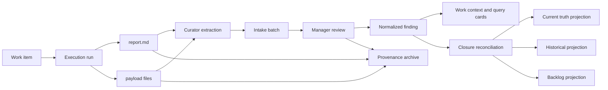

# RFC 0001: re-discipline campaign state and knowledge engine

**Status:** Implemented for re-discipline 0.8.0. Project conversion remains an
explicit migrator operation.

**Target:** re-discipline 0.8.0, shipped as one hard workflow and storage
cutover from 0.7.x. The release contains a resumable legacy reader and
migrator, but no deprecated checkpoint, promotion, masterfile-write, or report
stamp compatibility workflow.

**Canonical owner:** `plugins/re-discipline/` in the plugin source repository.
This document lives under `docs/rfcs/` so it is versioned beside the source but
is not auto-discovered as a skill, agent, hook, or runtime reference.

**Migration plan:**
[`../migrations/0.7-to-0.8.md`](../migrations/0.7-to-0.8.md).

**Amendments:**
[`0002-delivery-plan-amendments.md`](0002-delivery-plan-amendments.md)
ratifies this RFC's architecture but amends delivery sequencing, legacy
migration scope, enforcement scope, and the retrieval roadmap. Where the two
documents conflict, the amendment governs.

**Origin evidence:** the `snaphak-re` project record
`docs/backlog/knowledge-system-overhaul-handoff.md` contains measured retrieval
and campaign-loss observations from the 0.7 lineage. This RFC incorporates the
failure modes without treating that handoff's unverified claims as truth.

---

## 1. Executive decision

Re-discipline should stop treating an agent's context window and a large
`CAMPAIGN.md` file as campaign state. Model context is a disposable cache. The
repository and the knowledge server together must hold the durable state.

The replacement has three connected planes:

1. **Control plane:** small structured campaign, work-item, run, review, and
   event records that say what exists, what changed, what is blocked, and what
   is next.
2. **Knowledge plane:** atomic, typed findings with evidence, scope, status,
   tags, relations, and explicit review state. These are the primary retrieval
   units.
3. **Provenance plane:** run reports, briefs, context packs, payload files,
   review receipts, and closure coverage preserved so every finding can be
   traced back to its origin.

The shared state engine becomes the primary campaign-state and retrieval
implementation. The MCP server and a command-line interface are peer adapters
over that engine. They compile bounded context for a campaign or work item,
perform the same validated state transitions, and make normalized findings
retrievable. Files remain canonical and reviewable in Git; indexes and
databases remain disposable caches that can be rebuilt from those files.

Two existing user-facing skills are retired:

- `checkpoint-campaign` disappears because every meaningful state mutation is
  persisted transactionally when it happens.
- `promote-truth` disappears as a separate workflow. Manager ratification
  admits a finding only to campaign knowledge. The DIRECT-evidence and conflict
  boundary is preserved by closure, which is the only operation allowed to
  project a finding into `docs/truth/`.

Both skills disappear in 0.8.0. They do not survive as warning wrappers or
alternate write paths.

Closure stops compressing a campaign into one chronicle. It becomes a
resumable coverage and archival job: normalize every run, decide every
finding, project durable outputs, then move the complete campaign record into
`docs/history/campaigns/`.

The directory ambiguity is resolved decisively:

> A work item is the logical problem. A run is one attempt to solve it. The run
> directory is the only workspace. `report.md` is a file inside that workspace,
> not a second kind of directory.

There are no parallel `scripts/`, `analysis/`, `artifacts/`, and `evidence/`
trees. They overlap semantically: a script can be an artifact, analysis can be
evidence, and an artifact can be a deliverable. Run-private files instead live
under one lazy-created `payload/` root and receive typed roles in `run.json`.

---

## 2. Problems this design must solve

### 2.1 Context is being used as storage

Long sessions eventually compact. New sessions begin without the reasoning
that led to the current state. Onboarding can reload a summary, but it cannot
safely reload hundreds of reports and a multi-thousand-line masterfile.

The current response is to rewrite `CAMPAIGN.md` into a cold-resume document.
That makes one file responsible for objective, status, work graph, decisions,
findings, evidence handles, holds, blockers, and session narration. The file
grows until it is itself too expensive to load.

### 2.2 The campaign is a narrative, not a work graph

Managers create phases, dispatch investigations, discover blockers, split
work, defer questions, and branch into tangents. These are graph operations,
but the current format records them in prose and tables. A phase can be
abandoned implicitly, a tangent can lose its parent, and a HOLD can survive
only as a line someone remembers to reread.

### 2.3 Reports contain knowledge but are not knowledge records

A report is optimized for handoff from one worker after one attempt. It mixes
claims, caveats, raw observations, methods, failures, decisions, and suggested
next work. It is valuable provenance, but it is too coarse and too internally
mixed to be the primary long-term retrieval unit.

### 2.4 Closure is structurally lossy

One short chronicle cannot faithfully represent a campaign containing dozens
or hundreds of reports. Asking a closure agent to summarize harder cannot fix
that ratio. The missing operation is exhaustive transformation with coverage,
not better prose compression.

### 2.5 Retrieval can create its own context failure

Making more material searchable solves invisibility but creates another risk:
an agent can repeatedly ask broad questions and fill its context with loosely
related passages. Retrieval therefore needs progressive disclosure, hard
budgets, deduplication, and work-item-scoped context compilation.

### 2.6 Workflow correctness depends too much on voluntary skill use

Today the skills describe the lifecycle and agents are expected to apply it
correctly. Important state changes are distributed across Markdown edits,
report stamps, review ledgers, truth files, and checkpoints. The replacement
must enforce invariants at the write boundary rather than relying only on a
prompt remembering every rule.

---

## 3. Goals and non-goals

### 3.1 Goals

- Cold-resume any active campaign without rereading its complete history.
- Represent branches, dependencies, deferred work, blockers, retries, and
  spawned questions explicitly.
- Make normalized findings continuously retrievable during a campaign.
- Preserve the full provenance path from a durable claim to the run and source
  that produced it.
- Give managers bounded, task-specific context rather than corpus dumps.
- Let specialized curators perform extraction and normalization while keeping
  ratification authority with the manager.
- Make closure exhaustive, resumable, auditable, and safe to parallelize.
- Keep the repository human-readable and portable across manager hosts.
- Make server caches reconstructible from repository state.
- Migrate large existing campaigns incrementally without a flag day.

### 3.2 Non-goals

- The server does not decide whether a scientific or reverse-engineering claim
  is true.
- A curator does not receive authority to change current truth.
- Search relevance is not evidence quality.
- The design does not force every tiny management action to create a workspace.
- The design does not index raw logs, secrets, binaries, or all payload files
  by default.
- The design does not require loading all available context merely because it
  can be retrieved.
- The design does not replace normal source-control locations for maintained
  code, tests, tools, fixtures, or product assets.

---

## 4. Vocabulary

| Term | Meaning | Not the same as |
|---|---|---|
| Campaign | A bounded outcome with closure criteria and a graph of work | One session or one document |
| Work item | A logical task, question, decision, verification, or blocker | A directory full of scratch |
| Run | One bounded attempt by a manager, investigator, reviewer, or curator against one primary work item | A long-lived project phase |
| Run directory | The run's workspace and provenance capsule | A separate report directory |
| Report | The terminal synthesis written by a run | Canonical campaign state or normalized knowledge |
| Payload | Run-private files whose meaning is recorded in the run inventory | A trust or epistemic class |
| Finding | One normalized claim, method, decision, dead end, constraint, or open question | A whole report |
| Intake batch | Curator-authored candidate findings and coverage mappings awaiting manager review | Accepted knowledge |
| Review | A durable decision about a finding or intake item | An informal note in a masterfile |
| Projection | Materializing a ratified finding into truth, history, backlog, a playbook, or another maintained destination | Copying every report into truth |
| Context card | A compact finding or state summary returned before full source text | A complete source passage |
| Context lease | A bounded server-side ledger of what has been served for one task/session | Durable campaign state |

### 4.1 Workspace versus report directory

The current distinction should be deleted, not clarified.

- The **work item** answers: "What needs to be resolved?"
- The **run** answers: "Who made this particular attempt, with what brief and
  context, and what did it produce?"
- The **run directory** is where that attempt works.
- The **report** answers: "What did this attempt conclude?" It is one required
  terminal file in the run directory.

A work item can have several runs: an initial investigation, a failed attempt,
an independent challenge, and a follow-up verification. A run has exactly one
primary work item so its scope and completion test stay clear. A run may spawn
new findings and child work items, but it does not silently absorb them.

The phrase **report directory** is retired from the plugin vocabulary.

---

## 5. Architectural principles

### 5.1 Context is a cache

Anything needed after compaction must exist as a state record, event, finding,
report, or source change before compaction. "The agent remembers" is never a
valid persistence mechanism.

### 5.2 Files are canonical; indexes are derived

The repository must be sufficient to reconstruct campaign state and the
knowledge index. SQLite, vectors, rank caches, context leases, and other server
state under `.re-discipline/cache/` are replaceable.

### 5.3 State is structured; prose is explanatory

Status, ownership, dependencies, dispositions, and revisions belong in
validated fields. Prose explains why. Generated Markdown views can remain
pleasant to read without becoming the only state representation.

### 5.4 Findings are the retrieval unit

Reports are mapped into atomic findings. Default retrieval returns finding
cards and state cards. Full reports and raw provenance are expanded only when
the caller asks for a specific handle.

### 5.5 Evidence is a relation, not a folder

A file is evidence because a finding cites an exact path, digest, location,
and observation. Putting a file under a directory named `evidence/` does not
make it evidence, and a source file outside that directory can still be the
best evidence.

### 5.6 Review state and truth state are separate

Extraction, curator review, manager ratification, current validity, historical
validity, and evidence grade are different dimensions. They must not be
collapsed into one overloaded status such as PROMOTE or HOLD.

### 5.7 Every branch remains addressable

Phases are labels or milestones, not containers that hide work. Every task,
question, tangent, blocker, or deferment receives a stable work-item ID and an
explicit relationship to its parent or dependency.

### 5.8 Closure proves coverage

Closure is complete only when every run and candidate finding has a recorded
disposition and destination. A polished summary is optional; coverage is not.

### 5.9 Authority is enforced at mutation boundaries

The server validates schemas, roles, transitions, evidence requirements,
expected revisions, and path boundaries. Skills orchestrate user intent; they
do not independently define or bypass state law.

---

## 6. System model



The manager and workers do not consume this graph by reading every node. The
knowledge server compiles the smallest useful view for the requested campaign,
work item, or question.

---

## 7. Active campaign directory contract

```text
active/<campaign-slug>/
  campaign.json
  STATE.md
  work-items/
    W-0001.json
    W-0002.json
  runs/
    R-20260731-0001/
      run.json
      brief.md                 # required for delegated runs
      context-pack.json        # required when a pack was issued
      report.md                # required when completed or blocked
      payload/                 # optional; created only when needed
  findings/
    F-0001.md
    F-0002.md
  intake/
    I-0001.json
  reviews/
    V-0001.json
  events/
    events.jsonl
  closure/
    job.json                   # present only while closing
    coverage.json
```

### 7.1 What each top-level location owns

| Location | Owns | Must not own |
|---|---|---|
| `campaign.json` | Objective, scope, closure criteria, campaign status, revision | Session narration or all findings |
| `STATE.md` | Generated cold-resume view | Authoritative state or hand-edited decisions |
| `work-items/` | Logical work graph | Scratch files or reports |
| `runs/` | Every meaningful execution attempt and its private files | Cross-campaign truth |
| `findings/` | Normalized campaign knowledge | Raw transcripts or mixed report prose |
| `intake/` | Curator proposals and coverage mappings | Ratified decisions |
| `reviews/` | Manager decisions and review receipts | Mutable report content |
| `events/` | Append-only state transition journal | Large document bodies |
| `closure/` | Resumable closure state and coverage | The sole historical summary |

### 7.2 The single run workspace

A run directory replaces both the old subagent workspace and the imagined
report directory. Its reserved files have stable meanings:

- `run.json`: identity, actor, primary work item, status, revisions, context
  digest, file inventory, changed project paths, and output handles.
- `brief.md`: the exact delegated objective, boundaries, required output, and
  completion test. Optional for a manager's own run; required for delegation.
- `context-pack.json`: the immutable server-produced context supplied to the
  worker. It is not copied into the report.
- `report.md`: the run's terminal synthesis. It cites payload and project
  sources, states uncertainties, and lists spawned work. It is required for
  `completed` and `blocked` runs; an `aborted` run instead records why in
  `run.json`.
- `payload/`: any run-private inputs, probes, captures, intermediate analyses,
  patches, or outputs. It is created lazily and has no mandatory subfolders.

Workers may create task-native organization inside `payload/`, such as
`ghidra/`, `captures/`, or `patches/`, when that genuinely helps. They are not
asked to decide between generic overlapping bins.

### 7.3 File roles replace folder roles

`run.json` inventories important files along independent axes:

```json
{
  "path": "payload/parse_resource_table.py",
  "mediaKind": "source-code",
  "semanticRole": "reproducer",
  "retention": "candidate-maintained",
  "sha256": "...",
  "supports": ["F-0017"]
}
```

The controlled values are:

**`mediaKind`** describes what the file is:

- `source-code`
- `structured-data`
- `text`
- `image`
- `binary`
- `archive`
- `external-reference`

**`semanticRole`** describes why the run has it:

- `input`
- `raw-observation`
- `reproducer`
- `intermediate`
- `candidate-deliverable`
- `reference-copy`

**`retention`** describes what should happen later:

- `retain-inline`
- `candidate-maintained`
- `retain-by-reference`
- `distill-then-review`
- `discard-candidate`

These axes avoid false choices. A Python probe can be source code, a
reproducer, and a candidate maintained tool simultaneously.

No file is deleted merely because it is marked `discard-candidate`. Closure
requires an explicit manager disposition after coverage and provenance checks.

### 7.4 Project source changes do not move into payload

When a run edits ordinary project code, tests, truth documents, or product
assets, those files remain in their normal project locations. `run.json`
records them under `changedProjectPaths`, and `report.md` cites the relevant
diff, test, build, or revision. `payload/` is for run-private material, not a
second copy of the repository.

Temporary scripts begin in `payload/`. A script with an ongoing consumer moves
to the appropriate maintained `tools/`, source, or fixture location through a
reviewed projection. Its original run inventory then points to the maintained
destination and digest.

### 7.5 When a run is required

A run is required for investigation, implementation, testing, reverse
engineering, curation, or any activity that produces evidence or artifacts.
It applies equally to managers and delegated workers.

A run is not required for a small state-only action such as reprioritizing a
work item, recording a user decision, or linking two existing findings. Those
actions are still persisted as events.

---

## 8. Canonical records

All canonical structured records carry:

- `schemaVersion`
- stable `id`
- `createdAt` and `updatedAt` in UTC
- monotonic `revision`
- `createdBy` and last `updatedBy`
- a content digest or event correlation ID

Every mutation supplies `expectedRevision` and an idempotency key. The server
rejects stale writes rather than silently overwriting another manager or
worker.

### 8.1 Campaign record

`campaign.json` contains:

- title, slug, objective, scope, and explicit exclusions;
- success and closure criteria;
- status: `open`, `paused`, `closing`, `closed`, or `cancelled`;
- current focus work-item IDs;
- milestone labels, if useful;
- owner and permitted manager identities;
- opened, paused, closing, and closed timestamps;
- current state revision and last event ID;
- archive destination after closure.

It deliberately does not contain every work item or finding inline.

### 8.2 Work-item record

Each `work-items/W-*.json` contains:

- `kind`: `task`, `question`, `decision`, `verification`, or `blocker`;
- title and precise problem statement;
- state: `proposed`, `ready`, `active`, `blocked`, `deferred`, `done`,
  `cancelled`, or `superseded`;
- priority and milestone labels;
- acceptance criteria;
- parent, child, dependency, blocker, and spawned-by relations;
- active and completed run IDs;
- related finding and decision IDs;
- owner or assignee;
- a bounded `resumeNote` describing only the present edge;
- terminal outcome or deferment contract.

A work item cannot enter `deferred` without:

- a reason;
- a `revisitWhen` condition, date, dependency, or explicit destination;
- an owner or owning work item;
- a decision about whether it blocks campaign closure.

`revisitWhen` is evaluable rather than prose. It is exactly one of:

- `date`, with a UTC RFC3339 `at` timestamp; dates are `near` during the
  inclusive seven-day window before they become `due`;
- `work-item-state`, with a different canonical `workItemId` and exact target
  `state`;
- `event`, with an event-journal `action` and optional exact `affectedId`.

Every deferment also carries one closure disposition. A closure-blocking item
uses `resolve-before-closure` and has no destination. A non-blocking item uses
`export-backlog` and names a unique Markdown destination below
`docs/backlog/`; closure stages and verifies that durable projection before
the active campaign tree may be retired.

A phase is represented as a milestone label over work items. Starting a
tangent creates a child or spawned work item; it never replaces the original
item by prose implication.

### 8.3 Run record

Each `run.json` contains:

- run ID, campaign ID, and exactly one primary work-item ID;
- actor ID and role: `manager`, `investigator`, `reviewer`, or `curator`;
- status: `prepared`, `running`, `returned`, `completed`, `blocked`,
  `aborted`, or `invalidated`;
- brief and context-pack handles and digests;
- canonical exact-path and bounded-directory write grants, immutable after
  preparation and sealed into the run, context pack, and brief digests;
- start, return, review, and terminal timestamps;
- registered payload inventory;
- changed project paths;
- report path and digest;
- spawned finding and work-item IDs;
- terminal result summary;
- invalidation or retry relationship, when applicable.

The report can be edited while a run is `running` or `returned`. Once the run
is accepted as `completed` or `blocked`, the report digest is frozen. A
correction creates a new revision event or a follow-up run; provenance is not
silently rewritten.

### 8.4 Finding record

Each `findings/F-*.md` is one retrievable knowledge record with machine-readable
frontmatter and a small explanatory body.

Required metadata:

- finding ID and campaign ID;
- `kind`: `observation`, `conclusion`, `method`, `decision`, `constraint`,
  `dead-end`, or `open-question`;
- one atomic claim;
- subject and scope;
- applicability conditions and known limits;
- tags and subsystem labels;
- source run IDs;
- exact evidence references with path, digest, and line/range or object key;
- relations: `supports`, `contradicts`, `depends-on`, `supersedes`,
  `duplicates`, `answers`, and `spawned`;
- evidence grade;
- review state;
- validity state;
- intended or actual projection destination.

YAML frontmatter is canonical for findings. A truth projection is the same
canonical `FindingDocument`, published only after the closure gates under
`docs/truth/findings/<campaign-slug>/<F-id>.md`; it is not a second record
schema. This keeps machine-readable identity and human-readable explanation in
one atomic file, avoids sidecar drift, and remains ordinary Markdown for review
and Git.

The knowledge runtime assigns truth authority only to valid
`FindingDocument` files under `docs/truth/findings/**`.
`docs/truth/INDEX.md` is navigation. Legacy split manifests under
`docs/truth/splits/**` may remain as human compatibility views, but they are
not retrieval sources and cannot compete with their target findings. Loose
Markdown elsewhere under `docs/truth/` is likewise not a truth record; native
legacy root projections and deprecated flat `docs/truth/findings/F-*.md`
projections must be moved with the digest-bound `truth.relocate` manager
action.

A representative active finding begins:

```yaml
---
schemaVersion: 2
id: F-0017
campaignId: resource-registration
kind: conclusion
subject: engine.resource-registration
claim: Resource registration is driven by the named table under the stated build conditions.
scope:
  product: doom-2016
  builds: [subject-build-id]
validity: provisional
evidenceGrade: direct
reviewState: manager-ratified
verifiedAt: 2026-08-01
tags: [resources, registration, engine]
aliases: [resource table, asset registration]
sourceRuns: [R-20260801-0017]
dependsOn: []
contradicts: []
supersedes: []
projection: campaign
---
```

The frontmatter schema permits domain-policy extensions without embedding
reverse-engineering vocabulary into the storage core. For example, a project
policy may require `direct` evidence for truth while another domain supplies a
different named evidence grade. The core always stores the declared grade,
review authority, validity, and policy identifier.

The explanatory body uses stable sections:

```text
# Claim
## Applies when
## Does not establish
## Evidence
## Reproduction
## Relations
```

The claim remains concise. Long raw material stays in the source run. One file
represents one independently reviewable and independently supersedable claim,
not one sentence or one evidence observation. A synthesis that contains
facets which could be overturned separately must be split.

### 8.5 Independent epistemic axes

**Evidence grade** answers how the claim is supported:

- `direct`
- `inferred`
- `reported`
- `unknown`

**Review state** answers who has evaluated it:

- `extracted`
- `curator-checked`
- `manager-ratified`
- `manager-rejected`

**Validity state** answers how it should be used now:

- `provisional`
- `current`
- `challenged`
- `historical`
- `superseded`
- `invalid`

This prevents a reviewed historical dead end from being confused with current
truth, and prevents a DIRECT observation from becoming truth merely because it
was extracted correctly.

### 8.6 Intake batch

An `intake/I-*.json` is a curator's proposed transformation of one or more
runs. It contains:

- source run and report digests;
- candidate finding IDs;
- proposed duplicates and merges;
- conflicts with current truth or other findings;
- proposed spawned work items;
- proposed retention decisions;
- a coverage map from report sections or claim spans to one of:
  `candidate-finding`, `duplicate`, `non-claim`, `unresolved`, or
  `out-of-scope`;
- curator uncertainties and requested manager decisions.

An intake batch is not knowledge merely because it is well structured. Its
records stay in an intake-only retrieval class until reviewed.

### 8.7 Review receipt

A `reviews/V-*.json` records:

- reviewer identity and authority;
- reviewed intake and finding revisions;
- decisions for every candidate;
- evidence-grade corrections;
- merge, split, reject, challenge, or ratify decisions;
- projection destinations;
- rationale and unresolved conflicts;
- resulting event and record IDs.

Reviews are immutable receipts. A later decision creates another review linked
to the earlier one.

### 8.8 Event journal

`events/events.jsonl` is append-only and records every authoritative mutation:

- event ID and timestamp;
- actor and authority class;
- action and affected IDs;
- previous and resulting revisions;
- idempotency key;
- correlation ID tying a multi-file transaction together;
- compact rationale or review handle.

The event journal supports reconstruction, change-oriented resume, and
recovery. It is not the primary retrieval corpus for domain questions.

### 8.9 Generated state view

`STATE.md` is regenerated after state mutations. It contains only:

- campaign objective and closure criteria;
- current focus;
- active and blocked work items;
- deferred items whose revisit condition is now true or near;
- pending returned runs and intake batches;
- challenged or unresolved high-impact findings;
- recent decisions and the last event handle;
- the next recommended state transitions.

It is bounded by policy and may never become a historical transcript. Deleting
it and regenerating it must be safe.

---

## 9. Roles and authority

### 9.1 Manager

The manager owns campaign intent and all authoritative decisions. The manager:

- opens, pauses, closes, and cancels campaigns;
- creates and links work items;
- dispatches or performs runs;
- accepts or rejects run completion;
- reviews intake batches;
- ratifies, rejects, challenges, or supersedes findings;
- authorizes current-truth, history, backlog, playbook, tool, and asset
  projections;
- decides retention and deletion;
- certifies closure coverage.

The manager should not manually maintain a giant summary. It operates through
bounded server views and validated mutations.

### 9.2 Investigator

An investigator receives one run, one primary work item, a bounded brief, and
an immutable context pack. The investigator:

- works only within granted project and run boundaries;
- records exact evidence handles;
- writes `report.md` and registers important payload;
- names uncertainties, dead ends, and spawned questions;
- does not ratify findings, change current truth, close the campaign, or alter
  unrelated state.

### 9.3 Knowledge curator

The knowledge curator is a specialized subagent role. It should be delegated
routine but cognitively expensive knowledge processing:

- extract atomic candidate findings from returned runs;
- split compound claims;
- normalize tags, subjects, scope, conditions, and relations;
- connect exact evidence references;
- detect duplicates and possible contradictions;
- map report coverage;
- propose spawned work and retention destinations;
- assemble closure shards.

The curator may set `extracted` and `curator-checked`. It may never set
`manager-ratified`, declare a contested claim current, edit `docs/truth/`, or
make a terminal closure decision.

The curator writes only intake batches and curator-run outputs. This design
keeps normalization scalable without laundering delegated interpretation into
truth.

#### Curator review packets

The manager reviews a coherent packet rather than receiving one interaction
per finding or one all-or-nothing decision per report. A packet contains zero
to ten related atomic findings from one run or tightly coupled subsystem, plus
its coverage map. Three to ten is the preferred review batch when claims exist;
a zero-finding packet is valid when exhaustive coverage classifies the report
without producing a candidate finding:

```text
Intake I-0042 - source run R-0018
Coverage: 11 report sections accounted for

Finding  Claim                        Grade     Conflict  Recommendation
F-0081   Resource X uses table Y      direct    none      campaign knowledge
F-0082   Table Y is initialized here  inferred  none      keep provisional
F-0083   Existing truth Z is wrong    direct    yes       challenge Z
F-0084   Probe script is reusable     n/a       none      maintain tool
```

One manager submission may carry decisions for every row, but each finding
receives its own decision and immutable review receipt. Conflicted findings
cannot be bulk accepted. The packet links exact evidence and expansion costs
so the manager reads full reports only when the decision needs them. Packet
grouping is an interface convenience, never one epistemic decision.

### 9.4 Reviewer

An independent reviewer may challenge evidence, reproduce a result, or inspect
an intake batch. Its output is another run or review recommendation. Unless the
project explicitly grants manager authority, an independent reviewer cannot
perform the final ratification transaction.

### 9.5 Shared state engine and adapters

The shared state engine is a state custodian and context compiler, not an
epistemic judge. Both the MCP and command-line adapters call it. It:

- validates roles, paths, schemas, revisions, transitions, and invariants;
- writes related files atomically under a short-lived project-scoped
  transaction lock;
- appends events and regenerates derived views;
- indexes normalized findings and permitted provenance classes;
- compiles bounded state and context cards;
- checks structural requirements for ratification and closure;
- refuses unsafe or incomplete transitions;
- exposes conflict and coverage information to the manager.

The lock exists only while a transaction checks expected revisions and
publishes its files and event head. Readers do not take it, and no campaign or
run remains locked while an agent works. The MCP process does not own project
state merely because it is running.

### 9.6 User

The user retains strategic authority: priority, scope changes, risk decisions,
acceptance of contested tradeoffs, and any decision the project marks as
explicitly user-owned. Those decisions become events and, where reusable,
normalized decision findings.

---

## 10. Lifecycle

### 10.1 Session start

The normal entry path is:

1. `state(mode="orient")` returns project identity, active campaigns, urgent
   blockers, and server health within a small budget.
2. The manager chooses or is already scoped to a campaign.
3. `state(mode="resume", campaignId=...)` returns the generated state view and
   changes since the caller's last generation, not every campaign document.
4. `state(mode="work", workItemId=...)` compiles the exact task contract,
   linked decisions, dependencies, relevant findings, and source handles.
5. The manager expands only a cited handle needed for the next decision.

Reading all campaign masterfiles is removed from onboarding.

### 10.2 Opening a campaign

Opening creates `campaign.json`, the root work items, the event journal, and a
generated `STATE.md` in one transaction. The objective and closure criteria
must be present before the campaign can enter `open`.

No large template tree is precreated. Empty directories and payload category
folders are avoided.

### 10.3 Planning and branching

The manager represents planned work as addressable work items. Dependencies
and parentage are explicit. Milestones may group work for display, but they do
not own state.

When work reveals a tangent:

1. create a child or spawned work item;
2. record the relation and reason;
3. decide whether the original item stays active, becomes blocked, or can
   continue;
4. record a closure obligation or explicit non-blocking disposition.

The original thought therefore cannot disappear merely because attention
moved elsewhere.

### 10.4 Delegation

Delegation creates a run transactionally:

1. validate that the primary work item is dispatchable;
2. create `run.json` and `brief.md`;
3. compile a work-item-scoped context pack;
4. materialize and hash the pack in the run directory;
5. record the run on the work item and event journal;
6. dispatch the worker with write access limited to the run and explicitly
   granted project paths.

The context pack contains accepted constraints and relevant handles, not the
campaign's complete corpus.

### 10.5 Manager-executed work

When the manager performs substantive investigation or implementation, it
creates a manager run under the same model. This prevents important evidence
from existing only in chat while avoiding a separate manager scratch tree.

### 10.6 Run return and continuous curation

When a worker returns:

1. the server validates required files and freezes the returned report digest;
2. the run enters `returned`;
3. every substantive returned run automatically queues a curator run;
4. the curator writes an intake batch with complete report coverage;
5. the manager reviews the intake and source handles;
6. accepted findings enter campaign knowledge immediately;
7. manager-ratified findings remain in the `campaign` tier until closure;
8. new work items, challenges, and retention decisions are recorded.

This is the main knowledge-management loop. Closure should encounter mostly
normalized material, not a mountain of untouched reports.

Small runs may be curated directly by the manager. The same intake and review
records are still produced so the state model does not bifurcate.

Manager-ratified active findings are visible by default to managers in other
campaigns, labeled with their source campaign and provisional durability. This
prevents closure-gated truth from creating cross-campaign blindness. Drafters
receive such findings only when the manager's context-pack request includes
them. No active finding writes or edits `docs/truth/`; closure is the sole
projection boundary.

### 10.7 Deferral

Deferral is a state transition, not a paragraph. The server requires a revisit
contract and records whether the item blocks closure. `state(mode="resume")`
surfaces deferrals when their condition becomes relevant. Unresolved campaign
questions that outlive closure project to `docs/backlog/` with provenance.

### 10.8 Compaction

Pre-compaction no longer asks an agent to rewrite campaign state. The hook may
flush an already-started atomic mutation and emit the current campaign and
generation handles, but it performs no semantic checkpoint.

After compaction, the host calls bounded `orient` and `resume` operations over
MCP or the command-line adapter. If the last event ID has not changed, the
engine can return a smaller delta. The workflow survives even if compaction
occurs without warning because every completed transition was already
persisted.

### 10.9 Challenge and overturn

New contrary evidence first marks a finding `challenged`; it does not silently
replace it. The server exposes affected dependents. A manager review then may:

- dismiss the challenge;
- narrow the finding's scope;
- mark it historical or invalid;
- supersede it with a new finding;
- schedule correction or removal of its current-truth projection at closure.

The original finding, challenge evidence, decision, and dependent rechecks
remain traceable.

---

## 11. Closure and historical storage

### 11.1 Closure is a stateful job

Closing changes the campaign from `open` to `closing` and creates
`closure/job.json`. The job is resumable and records completed shards,
outstanding decisions, coverage, and the expected archive destination.

New ordinary runs are frozen while closing. The manager may explicitly reopen
the campaign or authorize a closure-remediation run.

### 11.2 Closure stages

1. **Inventory:** enumerate every work item, run, intake batch, finding,
   review, event, payload registration, and changed project path.
2. **Coverage:** require every terminal run to have accepted intake coverage.
3. **Normalize:** fan out curator runs over uncovered or legacy reports.
4. **Reconcile:** deduplicate findings, scan conflicts, and inspect dependency
   and supersession edges.
5. **Decide:** manager resolves every remaining finding, deferred item, and
   retention candidate.
6. **Project:** materialize current truth, historical knowledge, backlog,
   playbooks, maintained tools, fixtures, and asset destinations.
7. **Verify:** validate projection digests, source links, archive completeness,
   and retrieval reachability.
8. **Archive:** move the complete campaign record to history in one final
   transaction.
9. **Finalize:** mark the campaign closed, update navigation, and emit a closure
   receipt.

Multiple curators may process independent run shards. The server prevents two
shards from claiming the same run coverage without an explicit merge.

### 11.3 Required archive layout

```text
docs/history/campaigns/<yyyy-mm-dd>-<campaign-slug>/
  README.md
  manifest.json
  work-items/
  runs/
  findings/
  intake/
  reviews/
  events/
    events.jsonl
  closure/
    job.json
    coverage.json
    receipt.json
```

`README.md` is a generated navigational summary: purpose, outcome, major
decisions, durable destinations, unresolved leads, and how to query the
archive. It replaces the chronicle as the sole representation but does not
replace the underlying records.

### 11.4 Projection rules

| Finding outcome | Destination |
|---|---|
| DIRECT, manager-ratified, closure-approved current claim | `docs/truth/` plus archived source finding |
| Ratified historical observation, decision, method, or dead end | Archived finding indexed as history |
| Unresolved but worthwhile future work | `docs/backlog/` with finding and run provenance |
| Reusable procedure with an active consumer | `docs/playbooks/` |
| Maintained code, tool, fixture, corpus, or asset | Its normal project-owned location |
| Rejected or invalid claim | Archive with rejection review; excluded from default answer context |
| Duplicate claim | Archive relation to canonical finding; no duplicate truth file |

One finding can produce more than one projection when needed, but each
projection is recorded by destination and digest.

### 11.5 Payload retention

History must remain complete without turning every raw binary into default
retrieval content.

- Textual briefs, reports, manifests, findings, reviews, and coverage records
  are retained.
- Registered small payload with provenance value may be retained inline.
- Maintained outputs move to maintained project locations and remain linked by
  digest.
- Large or externally owned inputs may be retained by stable reference and
  digest rather than copied.
- Raw logs and binaries are excluded from default indexing even when retained.
- Destruction requires explicit manager approval and a coverage check showing
  what durable record replaces the file's value.

The archive manifest records missing, external, promoted, and intentionally
discarded payload distinctly. A hash without a recoverable source is not
misrepresented as preserved evidence.

### 11.6 Closure gate

The server refuses finalization unless:

- every work item has a terminal or explicitly exported state;
- every non-aborted run has a report and coverage decision;
- every intake item has a manager decision;
- every finding has a review and destination;
- every current-truth projection passes the DIRECT and conflict gates;
- every deferred closure-blocking item is resolved or explicitly exported;
- every registered file has a retention outcome;
- archive and projection digests verify;
- the history README and manifest can be regenerated from records.

This gate measures transformation coverage, not summary length.

---

## 12. Knowledge server redesign

### 12.1 New responsibility

The current server is primarily a deterministic Markdown retrieval system. The
target is a host-neutral local state-engine library with MCP and command-line
adapters. It becomes a campaign state engine, knowledge graph, and context
compiler while preserving deterministic, citable retrieval.

It owns four services:

1. **State store:** validated filesystem transactions, revisions, locks, and
   event append.
2. **Knowledge graph:** findings, evidence edges, work relations, dependencies,
   challenges, duplicates, and projections.
3. **Context compiler:** bounded orientation, resume, and work-item context.
4. **Retrieval engine:** deterministic card ranking and exact source expansion.

The engine does not own domain truth. It owns the mechanics that prevent an
unauthorized or structurally incomplete claim from crossing a trust boundary.

### 12.2 Canonical storage and cache

Canonical state lives in the campaign and `docs/` files defined here. The
server may maintain SQLite, FTS, graph, vector, generation, and context-lease
state under `.re-discipline/cache/knowledge/`. Deleting that cache and running
reconciliation must reproduce the same public state and source digests.

Every committed state head binds a canonical byte inventory. Before a normal
mutation, the engine verifies every tracked record, returned-run artifact,
event journal, truth projection, and campaign archive and detects unexpected
canonical records. Derived `STATE.md` views, caches, journals, and idempotency
receipts are excluded because they are reproducible machinery rather than
project truth.

Direct manual edits are supported only as break-glass recovery. An explicit
manager reconciliation may import a self-valid canonical record at its exact
revision and digest; the transaction emits an import event and advances the
head-bound inventory. Dirty event journals or other transaction-owned bytes
must be restored, and a reconciliation cannot adopt them implicitly while
importing an unrelated record. Unreconciled paths keep ordinary mutations
paused. Normal workflows mutate state through either adapter over the same
engine; the MCP process is not a single point of authority or availability.

### 12.3 Primary tool surface

The public surface should stay small and role-oriented.

| Tool | Purpose | Default authority |
|---|---|---|
| `state` | `orient`, `resume`, `work`, `delta`, and `closure` bounded views | Read-only |
| `query` | Return normalized finding cards under tier and token constraints | Read-only |
| `read` | Expand one exact finding, source, report slice, or citation handle | Read-only |
| `trace` | Follow evidence, dependency, challenge, supersession, run, and projection edges | Read-only |
| `context_pack_materialize` | Create an immutable run-scoped context pack | Manager/server orchestration |
| `campaign_merge_plan` | Validate exact source trees and return a deterministic digest-bound consolidation plan | Read-only |
| `manager_apply` | Typed campaign, work-item, run, review, finding, decision, merge, and destructive discard transitions | Manager only |
| `curation_submit` | Write intake batches and coverage for granted runs | Scoped curator |
| `closure_apply` | Start, advance, verify, reopen, or finalize a closure job | Manager only |
| `normalization_queue` | Inspect or advance durable demand-driven archive normalization work | Manager only |
| `migrate_project` | Preview, review, apply, resume, verify, and ratify the sole legacy conversion | Manager only |

The schemas use discriminated action variants rather than free-form patch
objects. Every mutation returns the resulting revisions, event IDs, generated
view digest, and any newly required decisions.

The CLI exposes equivalent operations and the same typed responses. The 0.8
release does not retain deprecated MCP aliases or legacy mutation paths:
`search` becomes `query`, default results change from chunks to normalized
cards, and neither checkpoint nor standalone truth promotion exists as an
engine action.

#### 12.3.1 Campaign topology transactions

Campaign-local identities remain immutable during ordinary transitions.
Consolidation is an explicit exception implemented as `campaign.merge`, not as
record import, reparenting, closure, or a successor pointing at archives. A
read-only `campaign_merge_plan` request names one absent target, at least two
exact open or paused sources in semantic order, the current state head, and an
explicit historical chronology. The planner validates every source graph and
file, records its tree digest, allocates collision-safe target IDs, maps every
artifact, reconstructs historical dates independently from migration
timestamps, and returns one deterministic digest. Planning writes nothing.

Application recomputes the plan, then rechecks the exact retained plan digest,
expected head, and source-tree digests under the writer lock. One transaction
creates the target tree; rewrites campaign, work-item, run, finding, intake,
review, review-load,
event, and path references; preserves source-qualified provenance, record
metadata, correlations, decisions, payloads, file modes, and raw source event
journals; publishes the target view, inventory, event, receipt, and head; and
retires all source trees. Returned and aborted run states are copied without
promotion. The durable target contains the plan, ID map, chronology, remapped
historical event stream, and source artifacts. Recovery either rolls the whole
operation forward after the committed head or restores every source and
removes the incomplete target. Exact retries replay the receipt; changed
requests conflict.

`campaign.discard` is a separately named unsafe operation, never an implicit
branch of closure or merge. It requires an exact campaign ID and slug, an open
or paused target, manager authority, expected head and campaign digest, a
non-empty reason, and the literal confirmation
`DISCARD <campaign-id> FROM <campaign-slug>`. An optional caller-supplied tree
digest strengthens the assertion; the engine always calculates and rechecks
the exact tree under the writer lock. The transaction removes the active tree
and canonical inventory membership without closure gates, projections, or an
archive, retaining only the minimum project-level event and receipt needed to
prove intentional destruction. Closed, missing, malformed, already-discarded,
and concurrently modified targets have explicit, tested outcomes.

Indexes, generated views, and caches do not acquire topology authority. The
transaction publishes the target `STATE.md` (or no campaign view for discard)
alongside the canonical inventory and head. The source-tree switch invalidates
the prior immutable search generation through its recorded source states; the
next reconciliation publishes a complete replacement generation.

### 12.4 State views

`state` modes are intentionally narrower than a campaign dump:

- `orient`: project identity, server health, campaign cards, urgent blockers,
  and recent changes.
- `resume`: one campaign's current focus, active graph frontier, pending
  returns/reviews, blockers, due deferrals, and last meaningful decisions.
- `work`: one work item's contract, dependencies, linked accepted findings,
  relevant prior attempts, conflicts, and exact source handles.
- `delta`: only changes after a generation or event ID.
- `closure`: coverage counts, missing decisions, failed gates, and archive
  projection status.

Every response declares its token cost, omissions, and expansion handles.

### 12.5 Context cards

Default query results are compact cards, not full report passages. A finding
card includes:

- atomic claim;
- subject and scope;
- evidence, review, and validity states;
- campaign or durable source class;
- relation alerts such as challenged or superseded;
- one finding handle and the strongest evidence handle;
- why it matched;
- an estimate of expansion cost.

State cards similarly summarize work items, runs, blockers, or decisions. The
agent calls `read` only for a card that matters to its next action.

### 12.6 Retrieval order

The intended agent protocol is:

1. relationship traversal from the selected campaign or work item;
2. exact normalized finding match;
3. scoped semantic retrieval to fill a named gap;
4. full provenance expansion only when evidence must be inspected;
5. broad corpus search only as an explicit fallback.

This reverses the common failure mode of broad search first and unbounded
reading afterward.

### 12.6.1 The 0.7 retrieval path

The existing server accepts natural-language or keyword queries. After hard
tier filtering it ranks Markdown chunks through exact matching, SQLite FTS5,
a bundled local dense model, relationship-graph expansion, weighted
reciprocal-rank fusion, and an optional deterministic reranker. The graph is
built from chunk adjacency, section parents, Markdown links, dependencies, and
supersession links. The agent then expands an exact citation with `read`.

The baseline hybrid profile uses `RRF_K = 60`, reranks the top 24 candidates,
and assigns weights `exact=8`, `fts=6`, `graph=2`, and `dense=4`. A project may
carry calibrated alternatives, but a runtime or model contract change can
invalidate them. Version migration must make that state explicit; it may not
silently present baseline behavior as the accepted project profile.

### 12.6.2 The 0.8 retrieval path and weights

The question-driven interaction remains, but its primary result becomes a
finding card rather than an arbitrary chunk:

```text
question
  -> authority and validity filters
  -> metadata/identifier, FTS, relationship-graph, and pinned dense lanes
  -> weighted fusion
  -> explicit relation expansion
  -> bounded finding cards
  -> handle-based evidence reads
```

State and work-graph traversal is deterministic and unweighted. Explicit
finding relationships are applied after candidate selection for dependency,
conflict, challenge, and supersession context; they are not an ordinary
relevance weight. Authority, tier, validity, secret exclusion, freshness, and
the evidence policy remain hard gates outside calibration.

The 0.7 numerical weights are not promoted into 0.8 merely because they once
passed. The representation, fields, and expected targets have changed. They
may seed candidate experiments, but a new finding-card development/holdout
suite selects the accepted profile. Calibration tunes only metadata/exact,
FTS, and graph fusion weights. The packaged holdout recorded no dense or
reranker improvement but was underpowered for a dense-removal decision. A
frozen pre-removal three-arm run over the expanded 64-case project corpus
recorded two dense-only rescues, no added hard-gate regression, and no reranker
contribution. Because the current runtime has no reranker implementation, its
clean final-corpus measurement is exactly two arms: lexical-graph baseline and
baseline plus dense. The rerank decision is bound separately to the immutable
pre-removal dense-versus-rerank rows; cross-runtime arms are never combined.
The 0.8 release candidate retains the checksum-pinned local dense lane pending
the fresh two-arm result. Reranking was removed on the frozen historical layer
plus the packaged holdout. The final receipt, historical archive, profile
inventories, and model inventories must agree. Field boosts, candidate depths,
and token budgets remain versioned policy until separate ablations justify
tuning them.

### 12.6.3 Claude Code and Codex parity

The Go stdio MCP core is host-neutral, and 0.7 already packages separate
Claude Code and Codex declarations. The 0.8 implementation must nevertheless
treat host parity as a tested contract:

- install the marketplace plugin into both hosts in conformance fixtures;
- verify discovery, startup, root resolution, tool naming, and deterministic
  response digests on supported operating systems and architectures;
- use simple discriminated JSON schemas that both hosts render accurately,
  avoiding opaque `oneOf` tool declarations;
- enforce declared manager, investigator, and curator roles with structural
  invariants and use symmetric `PreToolUse` hooks plus reconciliation as an
  accident boundary. The hook applies one write-class decision to Claude Code
  `Write`/`Edit` and Codex `apply_patch`. Current hosts do not attest caller
  identity, so 0.8 does not claim adversarial capability authentication;
- test mutation tools under each host's sandbox and approval model;
- make correctness independent of host-specific compaction or subagent hooks;
- provide the same operations through the CLI when MCP registration or process
  startup fails;
- require MCP and CLI calls over the same state revision to produce the same
  event and result digests.

### 12.7 Context flood controls

The server enforces progressive disclosure:

- every operation has a hard token budget;
- `state` and `query` have conservative defaults;
- default query returns at most one compact result set and five cards;
- full bodies never appear in default query output;
- repeated cards are deduplicated within a context lease;
- a work context lease tracks cumulative served tokens and source digests;
- delta mode returns only changed cards;
- expansion is explicit and handle-based;
- archive, rejected, invalid, raw-report, and intake tiers are opt-in;
- the server reports `insufficient`, `conflicted`, or `abstained` instead of
  padding the response with weak matches;
- the server never recursively executes suggested queries;
- suggested expansions include their expected token cost;
- a caller can reset a context lease after real compaction without mutating
  campaign state.

Suggested initial defaults, to be benchmarked rather than treated as truth:

| View | Default budget |
|---|---:|
| Project orientation | 800 tokens |
| Campaign resume | 1,500 tokens |
| Work-item context | 2,000 tokens |
| Finding query | 1,200 tokens / 5 cards |
| Exact read expansion | 1,500 tokens |
| Delegated context pack | 3,000 tokens |

### 12.8 Retrieval classes

The current path-only tier model expands to distinguish use, not just location:

- `profile`: project identity and laws;
- `navigation`: indexes and generated maps;
- `truth`: ratified current project knowledge;
- `campaign`: manager-ratified active findings;
- `provisional`: extracted or curator-checked active findings;
- `history`: ratified historical findings and decisions;
- `backlog`: intent and unresolved exported work;
- `memory`: accepted operational recall;
- `archive`: reports and provenance, opt-in;
- `intake`: unratified curator proposals, manager-review only.

Per RFC 0002 Amendment 3, `archive` does not become opt-in merely because a
measurement reports a pass. The shared engine must recompute the exact
ratified case-level evidence and atomically publish the durable report,
authorization receipt, and compare-and-swap policy update after an explicit
manager decision. Until that transaction succeeds, report provenance remains
enabled as the lower-ranked fallback lane.

Default manager work context includes profile, navigation, truth, campaign,
relevant history, and accepted memory. A delegated investigator receives only
the tiers and exact records required by its brief. Provisional, intake,
archive, rejected, and invalid material is excluded unless explicitly needed.

### 12.9 Conflict behavior

The server surfaces disagreement; it does not adjudicate it. When a query or
work context touches challenged or contradictory findings, it reserves space
for both cards, labels their states, and points to the required manager
decision. Superseded material cannot be returned as current without its
supersession marker and current replacement.

### 12.10 Failure and fallback

When the MCP server is unavailable:

- the manager invokes the packaged CLI adapter over the same state engine;
- the CLI takes the same short-lived transaction lock, validates the same
  expected revisions, and emits the same record and event shapes;
- read-only work may always use `STATE.md`, structured records, and exact
  source paths;
- agents must not simulate a successful authoritative transition by editing
  only a generated summary;
- a recovery command rebuilds the cache and validates the event head;
- if neither adapter can run, emergency manual edits mark the project dirty and
  require reconciliation before ratification, closure, or another ordinary
  mutation.

---

## 13. Closure-gated truth admission without `promote-truth`

Removing the skill must not remove the trust boundary, and manager review must
not edit truth before the campaign is ready to reconcile its whole result.

During an active campaign, `finding.ratify` can admit a reviewed finding only
to the `campaign` tier. Inferred findings may be useful ratified campaign
knowledge, while DIRECT findings become truth candidates. Both remain labeled
with campaign provenance and provisional durability. A challenge against an
existing truth overlays that truth in retrieval immediately so callers see the
disagreement, but the underlying truth file is corrected only when the
campaign closes.

Closure assembles the truth-projection set from manager-ratified candidates and
requires, for every proposed current truth:

- manager authority and the exact finding and review revisions;
- evidence grade `direct` under the project's configured evidence policy;
- one or more resolvable evidence references;
- a reproducible verification path or explicit durable observation contract;
- one independently reviewable and supersedable claim;
- value precision, subject, scope, aliases, tags, and applicability limits;
- no unresolved contradiction with current truth or another closure candidate;
- dependent, challenge, and supersession analysis;
- a target truth path or canonical merge target;
- archived source-finding and source-run destinations;
- closure coverage and an idempotency key.

In the closure transaction the engine:

1. freezes the approved projection set and source revisions;
2. writes or updates YAML-frontmatter truth files;
3. corrects challenged or superseded truth projections;
4. archives the source findings, reviews, runs, and coverage;
5. records bidirectional provenance and projection handles;
6. appends the closure and projection events;
7. refreshes affected index records and generated navigation;
8. returns truth and archive digests plus dependent warnings.

If any step fails, the closure does not publish a partial truth set. This
preserves the meaning of the old promotion boundary while eliminating a
standalone operation that could be forgotten, misordered, or partially
executed.

---

## 14. Plugin source changes

The installed 0.7.1 layout has lifecycle skills, hooks, templates, and a Go
knowledge runtime under `knowledge/`. The redesign touches all four; changing
only skill text would leave the failure mode intact.

### 14.1 Components removed or retired

| Current component | Target action |
|---|---|
| `skills/checkpoint-campaign/` | Delete in 0.8; transaction persistence and bounded resume replace it |
| `skills/promote-truth/` | Delete in 0.8; closure-gated truth projection replaces it |
| `templates/campaign-masterfile.md` | Retire as canonical state; replace with JSON schemas and generated `STATE.md` template |
| `templates/campaign-reviews.md` | Retire mutable ledger; replace with immutable review records |
| PreCompact checkpoint reminder in both hooks | Replace with state-handle emission and no semantic mutation |
| Mandatory onboarding read of all active masterfiles | Replace with server `orient` and scoped `resume` |
| Report stamp as the review boundary | Replace with intake, finding, and review records |

No warning wrappers or legacy workflow implementations ship. Only the explicit
migrator may read 0.7 structures, and it never writes them. New work uses the
0.8 state engine from the first post-upgrade mutation.

### 14.2 Skills rewritten

| Skill | New responsibility |
|---|---|
| `onboard` | Check server health, call bounded `state/orient`, choose a campaign, and call `state/resume` |
| `open-campaign` | Submit a validated campaign-open transaction and seed root work items |
| `delegate` | Open one run, generate brief and scoped pack, dispatch within the unified run directory |
| `review-subagent` | Validate returned run, invoke or consume curator intake, and record manager decisions |
| `close-campaign` | Orchestrate the resumable closure job and coverage gates |
| `overturn` | Drive challenge, dependent analysis, supersession, and projection correction transactions |
| `init-project` | Install the new schemas, policy, adapters, recovery commands, and migration marker |

Potential new skills should remain few:

- `resume-campaign`: explicit user-facing cold resume when requested;
- `review-intake`: manager review of a curator batch if it proves too large for
  `review-subagent`;
- `migrate-project`: preview, approve, resume, verify, and finalize the hard
  0.7-to-0.8 project and campaign conversion.

Knowledge curation itself is primarily an agent role plus server operation, not
a truth-changing skill.

### 14.3 New agent definition

Add `agents/knowledge-curator.md` with:

- a trigger description covering returned-run normalization, legacy report
  backfill, closure sharding, duplicate analysis, and coverage audits;
- inherited model selection unless evidence shows a smaller model is safe;
- least-privilege read access plus write access only to the granted curator run
  and intake destination;
- an explicit prohibition on truth edits, final evidence grading, manager
  ratification, deletion, campaign closure, and unrelated work;
- a required structured intake output and coverage accounting;
- instructions to abstain and request manager judgment when claim splitting or
  evidence interpretation is ambiguous.

Host adapters map this role to their native subagent mechanism. The role
contract remains identical across hosts.

### 14.4 Knowledge runtime changes

Existing Go paths are named here so implementation can be planned against the
actual source tree.

| Current path | Required change |
|---|---|
| `knowledge/internal/knowledge/mcp.go` | Define the new role-oriented tool surface, portable discriminated schemas, annotations, and no legacy aliases |
| `knowledge/cmd/re-discipline-knowledge/main.go` | Expose CLI operations over the same state engine and result schemas as MCP |
| `campaign_state.go` | Replace legacy masterfile scanning with structured campaign/work/run/finding state views |
| `service.go` | Add state, work-context, trace, context-lease, and card compilation services |
| `sources.go` | Index normalized active and archived findings; keep payload and intake excluded by default |
| `boundary.go` | Validate new run/archive paths and permit explicit safe reads without broadly indexing payload |
| `retrieval.go` | Rank finding/state cards first, enforce relation-aware conflict/supersession behavior, and preserve deterministic citation |
| `types.go` | Add canonical state, relation, review, card, lease, and transaction types |
| `migrate.go` | Add previewed legacy discovery, shadow manifests, physical conversion, resumable certification, and versioned profile conversion |
| `recovery.go` | Rebuild state/index caches from records and validate event heads |
| `index.go` | Track record revisions, projections, source digests, typed metadata fields, and archive classes |

Add focused modules rather than growing one service file indefinitely:

```text
knowledge/internal/knowledge/
  state_store.go
  transactions.go
  work_graph.go
  runs.go
  findings.go
  reviews.go
  context_cards.go
  context_leases.go
  closure.go
  archive.go
  capabilities.go
```

The exact split can change during implementation, but state transactions,
retrieval, and closure should not collapse into one untestable service.

### 14.5 Schemas

Add packaged schemas for:

```text
knowledge/schemas/
  campaign.schema.json
  work-item.schema.json
  run.schema.json
  finding-frontmatter.schema.json
  intake.schema.json
  review.schema.json
  event.schema.json
  closure-job.schema.json
  closure-coverage.schema.json
  archive-manifest.schema.json
  context-card.schema.json
  transaction.schema.json
```

Schemas are versioned. Migrations are explicit, idempotent, and tested against
older fixtures.

### 14.6 Templates and project adapters

Replace the current campaign and review templates with:

```text
templates/campaign/
  campaign.json
  work-item.json
  run.json
  brief.md
  report.md
  finding.md
  intake.json
  review.json
  STATE.md
  archive-README.md
```

Update manager adapters and the project profile so they state:

- server state views are the primary orientation surface;
- direct corpus grep is a fallback for project knowledge, not the first step;
- substantive work receives a work-item and run identity;
- reports are provenance and must be curated;
- only manager transactions can ratify or close;
- source files remain canonical and caches are derived.

Update the external drafter contract to use `runs/<run-id>/`, the single
`payload/` root, and structured file registration. Remove instructions that
create overlapping category folders.

### 14.7 Hooks

Update both PowerShell and POSIX hooks symmetrically.

- **SessionStart:** validate/recover the server and inject only a bounded
  orientation instruction plus active campaign handles.
- **PreToolUse:** apply the same write-class guard to Claude Code `Write`/`Edit`
  and Codex `apply_patch`; deny direct writes to engine-owned state while
  honoring only the exact report, payload, and project grants of a uniquely
  resolved registered run.
- **PreCompact:** emit current campaign, work-item, generation, and last-event
  handles; do not invoke checkpoint logic.
- **PostCompact:** request bounded resume and delta context.
- **SubagentStart:** remain silent for ordinary host subagents. Only when
  explicit dispatch metadata resolves one unique registered run and matches
  its immutable context-pack identity, inject run ID, work-item ID, brief path,
  context-pack digest, payload policy, and sealed write-grant scope.
- **SubagentStop/return:** remain silent for ordinary host subagents. Under the
  same unique-run and context-pack validation, check report presence and direct
  the caller to the engine return operation; the hook itself does not mark the
  run returned and does not imply review or ratification.
- **Stop:** warn on an in-flight, unpersisted server transaction, not on an
  absent manual checkpoint.

Hook behavior must be advisory where the host cannot guarantee delivery. The
workflow remains safe without a hook because completed state mutations are
already durable.

### 14.8 Configuration

The project configuration gains:

- campaign schema version;
- state and archive roots;
- server writer-lock and recovery policy;
- role authority and capability policy;
- context-card and lease budgets;
- source-class defaults;
- payload size and retention policies;
- generated view limits;
- closure coverage requirements;
- compatibility and migration mode.

Retrieval profile weights remain separately calibrated. Workflow policy must
not be hidden inside relevance weights.

### 14.9 Documentation

Rewrite:

- plugin `README.md` around the work-item/run/finding model;
- `references/knowledge-governance.md` around independent epistemic axes and
  manager ratification;
- `references/knowledge-internals.md` around canonical records, cache rebuild,
  tools, leases, and transactions;
- `references/reporting.md` around reports as provenance inputs to curation;
- runtime adapter documentation around scoped runs and curator dispatch.

The documentation must include one end-to-end worked example and one failed
transition example.

---

## 15. Migration from legacy campaigns

Large active campaigns cannot be converted by asking one agent to reread and
rewrite everything. Migration follows the same map-and-review design.

### 15.1 One hard release, resumable data conversion

Version 0.8 ships the new engine and removes the old workflows in one release.
The data conversion is still previewed, approved, resumable, and digest-gated
because a large project cannot be reorganized safely in one process lifetime.

The first 0.8 manager session detects legacy state and requires an explicit
`migrate-project --preview`. Preview discovers `CAMPAIGN.md`, `REVIEWS.md`,
subagent directories, truth records, retrieval profiles, and initialized
project contracts; assigns stable proposed IDs; calculates source digests;
estimates curator and storage work; and writes a read-only plan under the
project cache. It changes no canonical file.

If that inventory contains a runtime-incompatible accepted 0.7 retrieval
profile, preview exposes one digest-bound conflict packet. The packet contains
the exact legacy bytes and source snapshot together with the exact packaged
0.8 baseline, primary effective-profile digest, and measurement evidence. The
blocker can be cleared only by a sealed explicit manager decision that binds
all of those identities and fixes project-profile activation to false. The
manager supplies the UTC decision timestamp; replacements bind the exact
prior decision digest and preserve a strictly ordered history rather than
using an engine-generated wall-clock default. The
decision is replayed during preview, apply, and every pre-activation resume;
any source, baseline, evidence, or sealed-decision drift blocks again. The
legacy profile and decision become audit provenance, not an accepted project
profile.

The manager approves the exact plan digest before `migrate-project --apply`.
Apply creates shadow manifests while leaving legacy files in place, records the
0.8 state head, and routes every new mutation through the new run layout. The
legacy structures are then readable only by the migrator. There is no legacy
write path, checkpoint fallback, promotion fallback, report-stamp fallback, or
indefinite dual write.

Each campaign advances through explicit states:

```text
legacy
  -> inventoried
  -> shadow-indexed
  -> normalized
  -> physically-reorganized
  -> traversal-verified
  -> migrated
```

Only `migrated` means the conversion is complete.

### 15.2 Mapping rules

| Legacy object | New object |
|---|---|
| `CAMPAIGN.md` objective and closure sections | `campaign.json` fields plus frozen legacy source |
| Phase/task/lead rows | Candidate work items requiring manager confirmation |
| `subagents/<workspace>/` | One legacy run referencing the existing directory |
| `brief.md` | Run brief with original digest |
| `context-pack.json` | Run context pack with original digest |
| `report.md` | Frozen run report awaiting or linked to intake coverage |
| `scripts/`, `analysis/`, `artifacts/`, `evidence/` | Registered legacy payload paths with inferred roles marked `needs-review` |
| Report review stamp | Candidate review receipt; never invented when absent |
| `REVIEWS.md` entry | Candidate review/event record with source citation |
| HOLD/BLOCK/DEFER prose | Candidate finding or work item requiring manager decision |

Existing directories need not be physically moved immediately. A run manifest
can reference a validated legacy path until campaign closure archives it.

### 15.3 Curator backfill

Curators process legacy reports in bounded shards. Each shard:

- verifies source digests;
- extracts candidate findings;
- records full coverage;
- identifies review evidence that already exists;
- refuses to invent missing review decisions;
- proposes work-item and relation reconstruction;
- returns an intake batch for manager review.

The manager may ratify packets incrementally, and new work may continue through
0.8 runs after the shadow state head exists. The campaign is not called
migrated merely because its active frontier works. Outstanding historical
coverage remains visible and blocks migration certification.

### 15.4 Physical reorganization

Physical moves happen only after the shadow inventory, normalization coverage,
and destination plan verify. Each legacy subagent workspace becomes one run;
reserved files move to the run root, while old `scripts/`, `analysis/`,
`artifacts/`, and `evidence/` contents enter `payload/legacy/<old-role>/` with
an inventory mapping their original paths and digests. New runs never create
those legacy categories. Curator-approved maintained outputs move to their
normal project locations, and large payload follows the retention policy.

The move transaction stages destinations, verifies byte digests and rewritten
references, publishes the new tree, and only then retires the old paths. An
interrupted move resumes from its journal; it never guesses which copy is
canonical.

### 15.5 Masterfile retirement

After migration, the old `CAMPAIGN.md` is frozen as provenance, renamed or
archived as `legacy-masterfile.md`, and excluded from default active context.
`STATE.md` becomes the generated small view. No process appends new campaign
state to the legacy file.

### 15.6 Migration certification

A campaign is migrated only when an agent can fully and accurately traverse
its substantive evidence and the compiled context measurably preserves or
improves project awareness. Certification requires:

- every substantive report claim mapped to a finding, duplicate, non-claim,
  rejection, unresolved question, or out-of-scope decision;
- every accepted finding connected to its review, source run, report span,
  evidence handle, and reproducer or durable observation contract;
- every registered payload object reachable by path/reference and digest even
  when its raw bytes are excluded from model context;
- deterministic finding, campaign-context, evidence-trace, closure-coverage,
  authority, citation, abstention, and token-budget suites passing;
- cold resume recovering every active blocker, due deferment, current
  decision, returned run, and closure obligation under its budget;
- a fixed blinded agent evaluation showing non-inferior factual accuracy and
  decisions with equal or lower context cost, or a measured accuracy gain that
  justifies any extra cost;
- physical destination and archive digests matching the shadow inventory;
- identical MCP and CLI state/result digests and passing Claude Code/Codex
  conformance trials.

Migration certification consumes strict, gate-specific evidence rather than
generic assertions. The retrieval receipt re-hashes the exact final full
project benchmark, non-activating calibration, unapproved candidate profile,
and paired case-level blinded transcripts for every holdout case. The host
receipt stores a complete captured MCP/CLI/Claude Code/Codex
request-result-failure matrix and derives its semantic and per-host digests.
Random fingerprints, omitted trials, aggregate-only blinded scores, and
self-evaluation cannot satisfy either gate.

Fully traversable does not mean every binary byte is indexed or injected into
context. It means no substantive claim or registered evidence object is an
orphan, and an agent can follow bounded handles from question to claim to
review to source and reproduction.

### 15.7 Migration safety

- Never mark an unstamped report reviewed.
- Never infer DIRECT evidence solely from prose confidence.
- Never delete legacy payload during structural conversion.
- Preserve original paths, digests, timestamps, and review text.
- Make every batch restartable and idempotent.
- Report ambiguous phase/task reconstruction to the manager.
- Validate retrieval before declaring a migrated finding reachable.
- Never activate a stale or runtime-incompatible retrieval profile silently;
  require a digest-bound explicit manager decision over the exact legacy
  profile, current source fingerprint, packaged baseline, effective profile,
  and measurement evidence, or retain an attention state.
- A migration profile decision may retain the packaged baseline for conversion
  but must structurally deny project-profile activation or promotion. A stale
  source, packet, profile, evidence digest, or tampered decision restores the
  blocker; apply and resume must replay that check.

---

## 16. Required invariants

The server must enforce at least these rules:

1. A work item and run have stable IDs that are never reused.
2. A run has exactly one primary work item.
3. A delegated run cannot start without a brief and verified context pack.
4. A completed or blocked run has a frozen report digest.
5. A work item cannot be done while it has an unprocessed returned run that
   could change its outcome.
6. A deferred item has a revisit contract and closure-blocking decision.
7. A finding cites at least one source run.
8. A manager-ratified finding has an immutable review receipt.
9. A curator cannot set manager review or current-truth state.
10. A current-truth projection requires closure, DIRECT evidence, and conflict
    checks.
11. A challenged current finding is labeled challenged in retrieval.
12. A superseded finding points to its replacement, and the replacement points
    back.
13. A report is never returned as accepted knowledge without its finding or
    provenance label.
14. Payload directories are not indexed by default.
15. State mutations use expected revisions and idempotency keys.
16. Multi-file mutations either commit completely or recover to the previous
    valid event head.
17. `STATE.md` is regenerable and bounded.
18. Closing requires complete run, finding, work-item, and retention coverage.
19. Cache deletion cannot delete canonical campaign or knowledge state.
20. MCP unavailability cannot prevent the CLI adapter from applying the same
    validated transaction when the shared engine is healthy.
21. No active-campaign operation may write `docs/truth/`; only closure may
    publish, correct, or supersede a truth projection.
22. Cross-campaign use of active findings preserves the source campaign and
    provisional durability label.
23. The 0.8 runtime never writes a legacy masterfile, review ledger, report
    stamp, or category workspace.
24. A campaign cannot be labeled migrated before evidence traversal, context,
    host-parity, and physical-digest certification pass.

---

## 17. Testing and evaluation

### 17.1 State tests

- optimistic concurrency conflict between two managers;
- idempotent retry after a transport failure;
- crash between staged writes and event-head publication;
- event replay and cache rebuild;
- invalid role transition attempts;
- deferment without revisit condition;
- run completion without report;
- finding ratification with stale evidence digest;
- challenge and dependent-staleness propagation;
- closure refusal for every missing coverage class.

### 17.2 Retrieval tests

- ratified cases target finding IDs, expected evidence handles, graded
  relevance, allowed states, forbidden states, and hard negatives rather than
  only document paths;
- cold resume finds every active blocker and due deferral under budget;
- work context includes linked accepted constraints and excludes unrelated
  campaign history;
- normalized finding retrieval beats raw report retrieval for known questions;
- challenged and superseded claims cannot masquerade as current;
- repeated query under one lease returns deltas rather than duplicate text;
- opt-in archive lookup can trace a finding to its exact report and evidence;
- abstention remains correct when no sufficient finding exists;
- token accounting includes metadata and expansion hints.

Retain separate metrics for recall, MRR, nDCG, precision, complete evidence
coverage, citation precision/recall, abstention, relevant-token ratio,
duplicate-token ratio, latency, and local compute. Add frontier recall,
deferment recall, evidence-trace completeness, challenged/superseded safety,
and context-card expansion rate.

Calibration uses ratified development and frozen holdout splits. It may tune
only the declared finding-card fusion weights and must benchmark the sole
declared effective profile. Reintroducing a removed lane requires a new
positive holdout decision and release-contract change, not an implicit
fallback row. Tier/access filters, evidence authority, secret exclusion,
citations, freshness, deterministic replay, relationship behavior, and the
truth wall are hard gates and never tunable parameters. A candidate is not
activated as a benchmark side effect.

### 17.3 Curation tests

- compound report claims are split without losing qualifiers;
- migration coverage rejects a missing atomicity, evidence-grade, whole-span,
  semantic-boundary, legacy-authority, or manager-attention attestation, and an
  attestation never bypasses individual manager attention;
- candidate coverage cannot silently omit a trailing characterization or cut a
  sentence at a whole-line boundary; the unsafe combined span stays unresolved;
- every report span receives a coverage disposition;
- duplicate findings merge without losing source runs;
- curator uncertainty cannot become manager ratification;
- two parallel closure shards cannot double-claim coverage;
- rejected and dead-end findings remain discoverable in provenance mode but
  not current-answer mode.

### 17.4 Migration tests

Build fixtures representing:

- a small clean campaign;
- a huge masterfile with many unstamped reports;
- missing briefs and context packs;
- conflicting review ledger and report stamps;
- legacy folders with overlapping evidence/artifact roles;
- interrupted migration and safe restart;
- a partially migrated campaign receiving new v2 work;
- shadow-to-physical path and digest equivalence;
- stale project retrieval profiles across runtime/model contract changes;
- refusal to label a frontier-only conversion migrated.

### 17.5 Human workflow evaluations

Run realistic manager tasks and measure:

- tokens required for cold resume;
- time to identify the actual active frontier;
- percentage of deferred work still reachable after several tangents;
- percentage of returned runs normalized before closure;
- number of broad searches before a useful answer;
- context-card precision and expansion rate;
- closure coverage and number of missed claims found by audit;
- rate of unauthorized or malformed transitions caught by the server;
- manager review load per curator batch.

For ordinary retrieval development these trials remain an explicitly budgeted
end-to-end mode. For migration certification a small fixed blinded agent suite
is mandatory because the migration claim includes improved model context and
project awareness. Compare the legacy onboarding/masterfile context against
the 0.8 compiled context over repeated fixed tasks; record factual accuracy,
decision accuracy, unsupported claims, evidence-trace success, and token cost.

### 17.6 Host and adapter conformance

- install the packaged plugin from the marketplace into Claude Code and Codex;
- verify all tools are discovered with equivalent, usable schemas;
- run the same read and mutation corpus through MCP and CLI adapters;
- compare event IDs, record revisions, source digests, and public result
  digests;
- exercise Windows, Linux, and macOS launch paths supported by the release;
- exercise missing MCP roots and explicit `projectRoot` handling;
- exercise sandbox denial, user approval, process crash, restart, and CLI
  fallback;
- prove a missing compaction or subagent hook cannot lose committed state.

---

## 18. Implementation increments and exit gates

These are implementation increments, not campaign phases that may disappear
into prose. Each increment must be represented by work items with explicit
dependencies and exit gates.

### Increment A: schemas and read-only projection

Build schemas, IDs, legacy discovery, structured state readers, and generated
state cards without changing existing campaigns.

**Exit gate:** a large legacy campaign can produce a bounded, complete active
frontier and inventory, and cache rebuild is deterministic.

### Increment B: transactional v2 campaigns and unified runs

Implement the shared campaign/work/run transaction engine, short-lived writer
lock, event journal, generated `STATE.md`, revisions, new templates, and
equivalent MCP/CLI adapters.

**Exit gate:** a new campaign can survive forced compaction and process restart
without checkpointing or state loss.

### Increment C: findings, curator, and review boundary

Implement finding records, intake batches, the curator role, immutable review
receipts, and campaign-local indexing.

**Exit gate:** a returned run becomes searchable normalized knowledge without
editing a masterfile, and the curator cannot ratify it.

### Increment D: bounded context compiler

Implement state views, finding cards, trace, context leases, relation-first
work context, and retrieval evaluations.

**Exit gate:** cold resume and representative work contexts meet measured
token and recall targets without broad corpus reads.

### Increment E: campaign ratification and challenges

Implement manager-only campaign ratification, cross-campaign provisional
visibility, challenge overlays, supersession analysis, dependent analysis, and
atomic rollback. Do not write truth in this increment.

**Exit gate:** ratified active findings and challenges are visible with correct
authority and durability labels, and no active operation can modify truth.

### Increment F: closure and archive

Implement closure jobs, closure-only truth projection, parallel curation
shards, coverage gates, retention, history directories, navigation summaries,
and final receipts.

**Exit gate:** a multi-report fixture closes with 100 percent accounted runs,
findings, work items, and files, and every durable projection traces back to
its source.

### Increment G: hard migration and release certification

Implement preview/approval, shadow inventory, normalization, physical moves,
profile conversion, traversal certification, and representative project
pilots. The release artifact is built without checkpoint, promotion,
masterfile-write, report-stamp, or legacy workspace workflows.

**Exit gate:** the pilot campaigns meet the full `migrated` definition, both
hosts and the CLI pass conformance, and the 0.8 package contains no legacy write
path or deprecated wrapper.

---

## 19. Acceptance criteria for the architecture

The redesign is successful when:

- a fresh manager can resume a large campaign from a bounded state response;
- forced compaction loses no completed transition;
- every tangent and deferred item remains addressable and queryable;
- a manager can ask what is known about a subsystem and receive a handful of
  scoped finding cards rather than a report flood;
- exact provenance is one explicit expansion away;
- reports are normalized continuously and closure measures remaining coverage;
- a curator can fan out over reports without gaining truth authority;
- active findings improve cross-campaign awareness without presenting
  provisional knowledge as truth;
- current truth still requires the configured DIRECT evidence policy, manager
  ratification, complete coverage, and a closure transaction;
- closure produces a queryable history directory, not one lossy chronicle;
- the difference between work item, run, workspace, report, payload, and
  finding is unambiguous in both the filesystem and tool contracts;
- deleting the knowledge cache and regenerating it changes no canonical state;
- MCP and CLI adapters produce equivalent state and result digests;
- a migrated campaign passes complete claim/evidence traversal and blinded
  context-improvement certification;
- the 0.8 package contains no checkpoint, standalone promotion, masterfile
  write, report-stamp, or legacy workspace workflow.

---

## 20. Decisions made by this draft

These are accepted RFC choices, not claims about implemented behavior:

1. **One workspace model:** the run directory is the only workspace; there is
   no report-directory type.
2. **No categorical scratch folders:** one optional `payload/` root plus typed
   inventory replaces `scripts/analysis/artifacts/evidence` duplication.
3. **Logical work is separate from execution:** work items own state and
   relations; runs own attempts and files.
4. **Continuous normalization:** reports are curated when returned, not first
   encountered at closure.
5. **Specialized curator, bounded authority:** extraction and normalization can
   be delegated; ratification cannot.
6. **Filesystem-canonical state:** the shared state engine controls
   transactions, but its database is rebuildable and MCP is only one adapter.
7. **Finding-first retrieval:** normalized cards are primary; reports and raw
   passages are provenance expansions.
8. **Bounded retrieval:** leases, deltas, budgets, and handles prevent the
   knowledge server from becoming a context flood hose.
9. **No semantic checkpoints:** persistence happens on every transition;
   compaction only triggers bounded rehydration.
10. **No standalone promotion skill:** manager ratification creates campaign
    knowledge; closure alone performs an atomic truth projection.
11. **Directory archives:** closed campaigns retain their work graph, runs,
    findings, reviews, events, and coverage under `docs/history/campaigns/`.
12. **Chronicle becomes a view:** a generated archive README is useful
    navigation, never the only surviving representation.
13. **Automatic curation:** every substantive returned run queues curation;
    trivial runs may be normalized inline by the manager.
14. **Review packets:** curators submit zero to ten related atomic findings
    with exhaustive report coverage. Three to ten is the preferred non-empty
    batch; coverage-only packets remain valid, and every finding receives its
    own decision receipt.
15. **Cross-campaign awareness:** manager-ratified active findings are visible
    to other managers with explicit campaign-provisional durability.
16. **One finding format:** active, archived, imported-truth, and native-truth
    findings use the same YAML-frontmatter `FindingDocument`; one file owns one
    independently supersedable claim.
17. **General core, policy-specific evidence:** storage and transitions remain
    domain-neutral while projects configure named evidence policies such as the
    DIRECT wall.
18. **Hard 0.8 release:** old skills and write paths disappear in one release;
    only the explicit migrator may read 0.7 structures.
19. **Previewed migration:** the manager approves an exact migration-plan
    digest before any canonical conversion.
20. **Shadow then physical:** legacy paths remain until normalized shadow
    coverage and byte-digest verification authorize reorganization.
21. **Measured migration:** a campaign is migrated only after full substantive
    claim/evidence traversal, physical equivalence, host parity, and bounded
    agent-context improvement are verified.

---

## 21. Resolved decisions and remaining design questions

The 0.8 implementation resolves these former release questions:

1. Current hosts provide no trustworthy caller-attestation primitive. Signed
   capabilities are deferred; declared roles, structural engine invariants,
   run-bound structured write grants, symmetric hooks, and reconciliation ship
   as an explicitly non-adversarial accident boundary.
2. Context leases are caller-named and process-local. They maintain only
   in-memory deduplication and accounting and reset on request or process exit.
3. The public MCP surface is exactly eleven tools. Discriminated actions remain
   within those tools, with the same operation contracts available through the
   CLI.
4. Finding frontmatter uses the implemented strict YAML subset and parser,
   which rejects implicit scalar surprises and non-round-trippable shapes.
5. Emergency reconciliation operates inside the same non-adversarial threat
   model: it detects out-of-band bytes and requires an explicit manager import
   with expected digests and rationale. It does not manufacture host-attested
   actor identity.

The following post-0.8 choices still require project evidence:

1. What payload size thresholds, content-addressed storage, and external-object
   policy fit projects that produce large captures or binaries?
2. Should all normalized history findings participate in default manager
   context, or should older history require an explicit query class?
3. What fixed model, trial count, and variance rule make the mandatory blinded
   migration evaluation reproducible enough to certify context improvement?

These remaining questions do not reopen the accepted storage, authority,
closure, or migration model.
